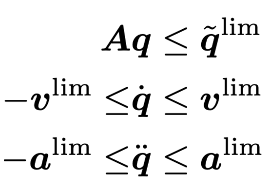

# Viability_IK
## Introduction
``Viability_IK`` is a library that implements a quadratic programming (QP)-based inverse kinematics (IK) method. It simultaneously accounts for physical joint limits (_including joint range, velocity, and acceleration constraints_) and whole-body collision avoidance (_including self-collisions and collisions with static obstacles_), which can be ensured by satisfying the following constraints:

<p align="center">

</p>

These constraints may conflict with each other and result in infeasible solutions of IK, which can subsequently produce unpredictable motions.
``Viability_IK`` ensures that the robot state is **viable**, guaranteeing the existence of solutions that do not violate the given constraints. Please check the accompanying [paper](https://jxiv.jst.go.jp/index.php/jxiv/preprint/view/1053) for more details.

A simple simulation program is provided in the ``examples`` folder as ``example_py.py``, which can be launched after the installation of ``Viability_IK``.
As in the following screenshot of the simulation, the solution of ``Viability_IK`` satisfies all the constraints while tracking the target position (red point). The **position constraint** is indicated by the black dashed polygon in the **top-right** subplot. The **velocity constraint** and **acceleration constraint** are represented by the dot-dashed lines in the **bottom-left** and **bottom-right** subplots, respectively.

<p align="center">

</p>

## Installation within Conda
``Viability_IK`` relies on several complex dependencies, making it difficult to build from source.
Therefore, we strongly recommend build it within Conda environment, as detailed in the tutorial below.
It allows for quick deployment across Windows, macOS, and Linux.
For users who prefer to install everything from source, we have listed the dependencies at the end.
### Configuration of Conda
To get started with conda (or mamba) as package managers, you need to have a base conda installation. Please _do not_ use the Anaconda installer, but rather start with [Miniforge](https://github.com/conda-forge/miniforge) that is much more "minimal" installer (_even though some insufficient tests have shown that ``Viability_IK`` can be built within env installed by Anaconda_). This installer will create a "base" environment that contains the package managers conda and mamba. 

To create a new Conda environment with a specified name (e.g., ``via_ik``) and activate it, run the following commands:
```sh
conda create -n via_ik python=3.11 -y
conda activate via_ik
```
**Note:** All subsequent operations must be performed within the activated Conda environment.

In Conda installations managed by Miniforge, ``conda-forge`` is set as the default (and only) channel. It provides all the necessary dependencies for ``Viability_IK`` across major platforms:
```sh
conda install scip casadi compilers cmake make git doxygen pkgconfig boost pybind11 matplotlib -c conda-forge -y
```
The package ``compilers`` installed by above commands includes ``MinGW-w64`` for Windows, ``Clang`` for macOS and ``GCC`` for Linux. If you prefer other compilers like ``Ninja`` or ``MSVC``, please install them by yourself.
### Build and installation of Viability_IK
The Build and installation of ``Viability_IK`` in Conda can be performed using the following standard CMake procedure:
```sh
git clone --recursive https://github.com/zyc1155/Viability_IK.git
cd Viability_IK
cmake -S . -B build -DCMAKE_BUILD_TYPE=Release  # Use <-G "compiler name"> to specify your preferred compiler if necessary
cmake --build build --config Release
cmake --build build --target install --config Release # Add <sudo> at the beginning if permission denied occurred
```
## Installed files
A C++ shared library named ``viability_ik`` is generated to Conda env, with CMake support. 
To use it in another project, add ``find_package(viability_ik)`` in your CMake configuration.

Additionally, a Python wrapper, ``py_viability_ik``, for the shared library ``viability_ik`` is also installed in the Conda env. 
You can import it directly in Python using ``import py_viability_ik``
## Examples
The ``examples`` folder, located in the root directory, contains two example files: ``example_cxx.cpp`` for C++ and ``example_py.py`` for Python.
### Example for C++
An executable ``viability_ik_example_cxx`` will be installed into ``${CONDA_PREFIX}/bin`` on Unix-like systems or ``${CONDA_PREFIX}/Library/bin`` on Windows. This executable is generated from ``example_cxx.cpp``, which can be utilized to test the installation of the shared library ``viability_ik`` and as an example of the usage of the library. Please run it from a terminal with the corresponding Conda env activated.
### Example for Python
You can launch ``example_py.py`` through an activated Conda env to enjoy the simulation of a two-DOF robot. The interface is written based on [Matplotlib](https://github.com/matplotlib/matplotlib). You can set the target position in realtime by clicking the top-left subplot, and pause or resume the simulation by clicking the corresponding button.

<p align="center">

</p>

## Interface to QP solvers
``Viability_IK`` utilizes [CasADi](https://github.com/casadi/casadi) as an interface to QP solvers. 
This approach offers two key advantages:
* **Symbolic Computation Acceleration:** Leveraging symbolic computation enhances problem-solving efficiency.
* **Flexible Solver Switching:** Allowing easy switching between different QP solvers.

For more details, refer to the [CasADi documentation](https://web.casadi.org/docs/).

## QP solvers
In ``Viability_IK``, two QP solver are utilized for different purpose:
* [OSQP](https://github.com/osqp/osqp) is chosen for offline construction stage because it is efficient for large-scale sparse problems.
* [qpOASES](https://github.com/coin-or/qpOASES) is chosen for online computation stage because of high accuracy and warm-start supporting.

## For common build
### CMake options
* ``BUILD_IN_CONDA`` Build project in conda environment (ON/OFF, default: ON)
* ``BUILD_CXX_EXAMPLE`` Build cxx example (ON/OFF, default: ON)
* ``BUILD_PYTHON``  Build python wrapper (ON/OFF, default: ON)
* ``BUILD_PYTHON_PATH``: Installation path for python wrapper, will be referred if ``BUILD_PYTHON`` is ON and ``BUILD_IN_CONDA`` is OFF.
### Dependencies
To compile and run the C++ library of ``Viability_IK``, you need to install the following dependencies:
* [CasADi](https://github.com/casadi/casadi): A symbolic framework for numeric optimization and algorithmic differentiation.
* [SCIP](https://github.com/scipopt/scip): A fast solver for mixed integer programming (MIP) and mixed integer nonlinear programming (MINLP). 
* [Eigen](https://github.com/PX4/eigen): A C++ template library for linear algebra: matrices, vectors, numerical solvers, and related algorithms.
* Other compilation dependencies, including [CMake](), [git](), [pkg-config](), [doxygen](), [Boost](), and necessary compilers.

For building and running Python wrapper, the follows are needed:
* [pybind11](https://github.com/pybind/pybind11): A lightweight header-only library that exposes C++ types in Python, and vice versa, mainly to create Python bindings of existing C++ code.
* [Matplotlib](https://github.com/matplotlib/matplotlib): A comprehensive library for creating static, animated, and interactive visualizations in Python.

Moreover, the following packages are embedded in our code, so you do not need to install them separately:
* [cddlib](https://github.com/cddlib/cddlib): An efficient implementation of the Double Description Method for generating all vertices (i.e., extreme points) and extreme rays of a general convex polyhedron, and vice versa.
* [eigen-cddlib](https://github.com/vsamy/eigen-cddlib): A simple wrapper to use Eigen matrix with cddlib.

## Citation
```sh
@article{Zhang_2025_ViabilityIK,
  title={Ensuring Viability: A {QP}-Based Inverse Kinematics for Handling Joint Range, Velocity and Acceleration Limits, as Well as Whole-body Collision Avoidance},
  author={Zhang, Yachen and Kikuuwe, Ryo},
  publisher={Jxiv},
  year={2025},
  doi={10.51094/jxiv.1053},
}
```


